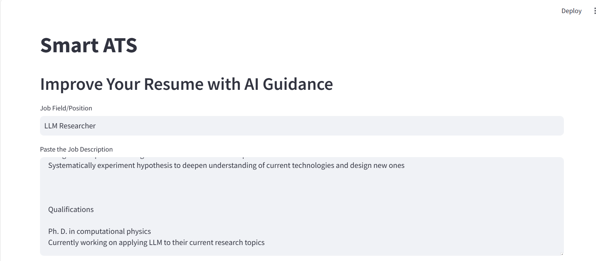
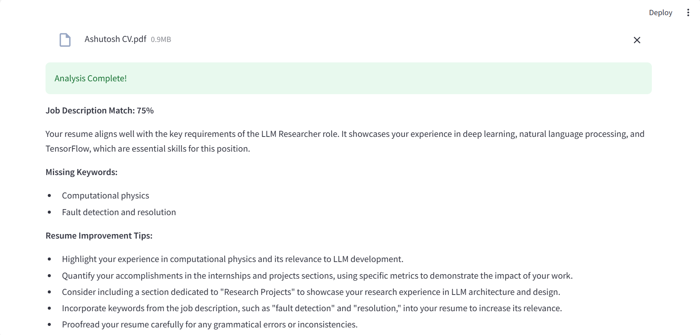

**Google Gemini API Projects**

This repository contains various projects that utilize the Google Gemini API for natural language processing tasks. The projects cover a range of applications, including resume screening, invoice extraction, question answering for multiple PDFs, and text-to-SQL query conversion.
Projects 
**1. ATS Resume Screening**

This project aims to automate the resume screening process for Applicant Tracking Systems (ATS). It leverages the Gemini API to extract relevant information from resumes, such as work experience, skills, and educational qualifications. The extracted data can be used to rank and filter candidates based on predefined criteria. 
**2. Invoice Extractor**

The Invoice Extractor project uses the Gemini API to extract key information from invoices, such as vendor details, invoice number, date, total amount, and line items. This can streamline the invoice processing workflow and improve data accuracy. 
**3. Multiple PDF Question Answering**

This project demonstrates how to use the Gemini API to ask questions and receive answers based on the content of multiple PDF documents. It can be useful for research, legal document analysis, or any scenario where information needs to be extracted from a collection of PDF files. 
**4. Text to SQL Query**
The Text to SQL Query project leverages the Gemini API to convert natural language questions or prompts into SQL queries. This can be beneficial for building conversational interfaces for database exploration or building tools that simplify the process of writing SQL queries. 

**Getting Started**
To get started with these projects, you'll need to have access to the Google Gemini API and set up the necessary authentication credentials. Please refer to the Google Cloud Documentation for more information on obtaining API credentials and setting up your environment.
Each project has its own directory within this repository, containing the necessary source code, configuration files, and documentation. Please refer to the individual project directories for more detailed instructions on running and using the projects. 
Contributing
Contributions to this repository are welcome! If you find any issues or have suggestions for improvements, please open an issue or submit a pull request. When contributing, please follow the code of conduct and adhere to the existing coding style and conventions. 

**Acknowledgments** 

The Google Gemini API team for providing this powerful natural language processing tool. 
** Sir Krish Naik's tutorials using Google Gemini API** 
https://www.youtube.com/watch?v=it0l6lx3qI0&list=PLZoTAELRMXVNbDmGZlcgCA3a8mRQp5axb
